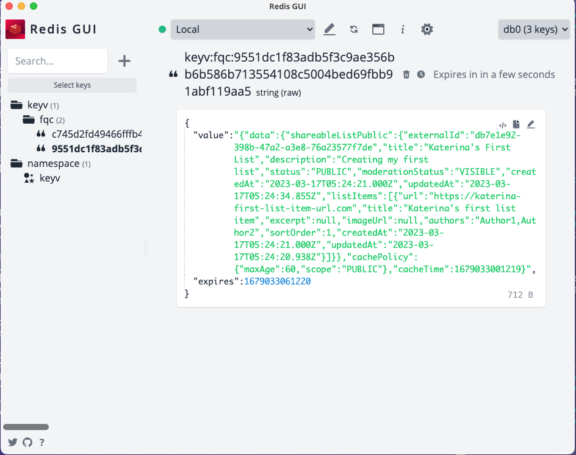

# Shareable Lists API
[Service Docs](https://getpocket.atlassian.net/wiki/spaces/PE/pages/2891776041/Shareable+Lists)

The API that manages the ability to create and share lists of related content.

## Application Overview

[Express](https://expressjs.com/) is the Node framework, [Apollo Server](https://www.apollographql.com/docs/apollo-server/) is used in Express to expose a GraphQL API, and [Prisma](https://www.prisma.io/) is used as the ORM. [MySQL](https://www.mysql.com/) is the relational database, though in AWS this is [Aurora Serverless](https://aws.amazon.com/rds/aurora/serverless/).

## Folder structure

- the infrastructure code is present in `.aws`
- the application code is in `src`
- `.circleci` contains circleCI setup

## Local Development

### Fresh Setup

Clone the repo:

- `git clone git@github.com:Pocket/shareable-lists-api.git`
- `cd shareable-lists-api`

Prepare Prisma:

- `npm install`
- `npx prisma generate` (this generates Prisma Typescript types)

Start Docker container:

- `docker compose up --build -V`

Once all the Docker containers are up and running, you should be able to reach

- the public API at `http://localhost:4029/`
- the admin API at `http://localhost:4029/admin`

Out of the box, the local installation doesn't have any actual data for you to fetch or manipulate through the API. To seed some sample data for your local dev environment, run

```bash
docker compose exec app npx prisma migrate reset
```

Note that the above command will not be adding to any data you may have added to the database through other means - it will do a complete reset AND apply the seed script located at `src/prisma/seed.ts`.

### Admin API Authorization

The admin API requires HTTP headers be set to authorize operations.

To run queries _against the `/admin` API_ in the GraphQL playground, you'll need to specify some HTTP headers. To do so:

1. Open up the GraphQL playground at `http://localhost:4029` and make sure your playground tab's address is `http://localhost:4029/admin`.
2. Click the **HTTP HEADERS** link at the bottom of the left hand side of the playground to reveal a text box.
3. Enter the necessary headers (see sample below) into the box and try an operation - it should work!

The sample headers below allow full access to all queries and mutations:

```typescript
{
  "groups": "mozilliansorg_pocket_moderation_full",
  "name": "Matt McPockets",
  "username": "mmcpockets"
}
```

Note that the `groups` header can contain mulitple values separated by commas (but still in a single string).

If you'd like to experiment with different levels of authorization, you can find the full list of Mozillian groups on our [Shared Data document](https://getpocket.atlassian.net/wiki/spaces/PE/pages/2584150049/Pocket+Shared+Data#Source-of-Truth.3).

### Testing Sentry

To test Sentry within a local instance of the API:

- Add `SENTRY_DSN` env to `.docker/local.env`. The DSN value can be found in the [Sentry project](https://sentry.io/settings/pocket/projects/shareable-lists-api/)
- In `docker-compose.yaml`, change the node environment under `app` to `development`:

```
environment:
	- NODE_ENV=development
```

- Add a `try/catch` block in a query / mutation, throw an error and capture it with `Sentry.captureException(err)`
- In `src/public/server.ts` and or `src/admin/server.ts` replace `nonProdPlugins` with:

```
const nonProdPlugins = [
	ApolloServerPluginLandingPageGraphQLPlayground(),
	ApolloServerPluginInlineTrace(),
];
```

### Adding a Migration

If you need to change the Prisma schema (in `prisma/schema.prisma`), you'll need to create a migration to ensure the database is in sync. After you have made your changes to `schema.prisma`, run

```bash
docker compose exec app npx prisma migrate dev --name some_meaningful_migration_name
```

This will create a migration script in `prisma/migrations` and will automatically run the new migration. This will also re-create your Prisma Typescript types.

#### Re-creating Prisma Typescript Types

If your local environment gets messed up (it happens - for example switching to a branch with a different prisma schema), you can re-create your Prisma Typescript types by running `npx prisma generate`. (Note that you don't have to do this within the Docker container, but you can if you want.)

### Running Tests

A `userId` in the headers is needed in order to run mutations:

```typescript
{
	"userId": "12345"
}
```

We have two test commands, one for unit/functional tests and one for integration tests. These are both run by [Jest](https://jestjs.io/) and are differentiated by file names. Any file ending with `.spec.ts` will be run in the unit/functional suite, while integration tests should have the `.integration.ts` suffix.

Test are run via `npm` commands:

- Unit/functional:

```bash
npm test
```

- Integration:

If tests rely on MySQL and AWS (which is mocked by a [localstack](https://github.com/localstack/localstack) Docker container locally):

```bash
docker compose exec app npm run test-integrations
```

If tests don't rely on other services:

```
npm run test-integrations
```

### Snowplow Events

This API sends two kinds of events to the Pocket Event Bridge --> Snowplow: `shareable-list` and `shareable-list-item` events.

- `shareable_list` JSON schema: [Snowplow schema](https://console.snowplowanalytics.com/cf0fba6b-23b3-49a0-9d79-7ce18b8f9618/data-structures/7b895f09809942a835587b02a58b7a835f92e16a726f5d224a43b90d219ae9c4)
- `shareable_list_item` JSON schema: [Snowplow schema] (https://console.snowplowanalytics.com/cf0fba6b-23b3-49a0-9d79-7ce18b8f9618/data-structures/5c6a2540cd75d3baef34f659a7902732616502c996e513770d7e2c8bad926fc6)
- event triggers: [object_update Snowplow schema](https://console.snowplowanalytics.com/cf0fba6b-23b3-49a0-9d79-7ce18b8f9618/data-structures/a30c8f05ecf12d2b53202ed1cf161a4c578fab653f846550a20392659449dbad)

The API maps the GraphQL API types to the Snowplow types and sends both events to the Pocket Event Bridge. The core logic happens in `src/snowplow/events.ts` where the `sendEvent` function takes in a payload and sends it to the Pocket Bridge.

### To set up a new Snowplow event:

In `src/aws/config/index.ts`:

1. Add a new event to `eventBridge` and define the source.

In `src/snowplow/types.ts` do the following:

1. Add the expected Snowplow type.
2. Add the event bridge event type to `EventBridgeEventType` enum.
3. Add an `EventBusPayload` for your type.
4. To the `EventBridgeEventOptions` interface, add your event type and a boolean to indicate what event you are passing.

In `src/snowplow/types.ts` do the following:

1. Add your transformer function which maps the GraphQL API type to the expected Snowplow type.
2. Add the function which generates the Snowplow type payload.
3. In `sendEventHelper` function, add a conditional for what event option you are passing and call `sendEvent` function and pass the payload.
4. Finally, in the `sendEvent` function, based on the boolean flag, set the event bridge source.

### Unit tests

The unit tests for Snowplow events are defined in `src/snowplow/events.spec.ts`. [https://sinonjs.org/](Sinon JS)is used for test spies and stubs.

### Redis Cache

The Redis container runs on `localhost:6379`. To connect to the local Redis server (works for `dev` and `prod` as well, just find the Redis cluster primary endpoints in AWS ElastiCache and make sure to use the appropriate `$(maws)` role), one of the options is to install the [redis-gui](https://github.com/ekvedaras/redis-gui/releases) and set up the connection to `localhost:6379`.

The `shareableListPublic` query caches the responses and stores them for 60 seconds in the Redis db. Here is a screenshot of how it gets stored:



## Resetting Dev

There may come a time when you need to reset the Dev environment.

For example, if you were testing a schema change and then want to test a different branch without that schema change, the Dev database and Prisma schema will be out of sync.
Another common scenario is the need to reset all test data to the initial seed data provided by the seed script.

To reset the Dev database, [follow the instructions in Confluence](https://getpocket.atlassian.net/wiki/spaces/PE/pages/2938273799/Resetting+Data+for+a+Prisma-based+Subgraph+on+Dev).

