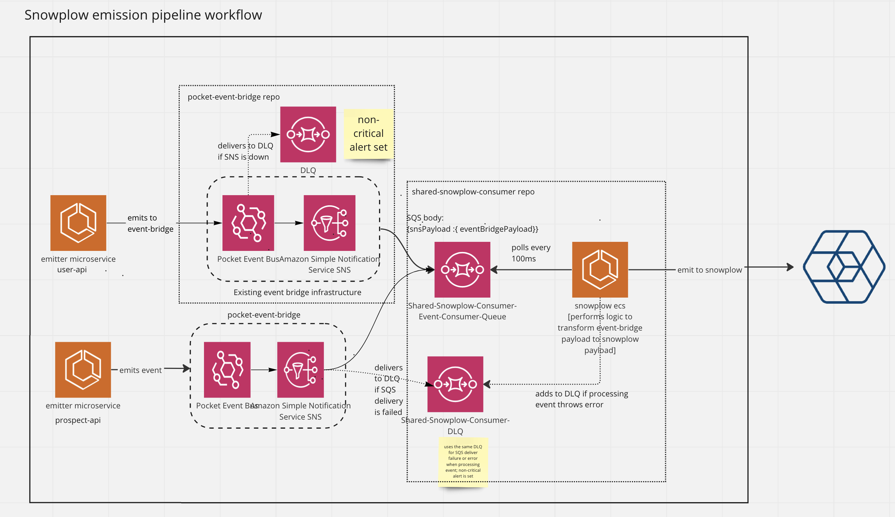

# SharedSnowplowConsumer

shared consumer for consuming from event-bridge and emitting to snowplow.


Architecture diagram: <https://miro.com/app/board/uXjVO5oHq_U=/>

## Folder structure

- the infrastructure code is present in `../infrastructure/shared-snowplow-consumer`
  - the SQS should be able to listen to the SNS/eventBridge rule that you want to onboard.
- the ECS application code is in `src`. This sends the event to snowplow.
  - the `sqsConsumer` contains logic to consume from the SQS queue.
  - the `eventConsumer` contains logic to consume from event-bridge and transform them to snowplow.
  - the `snowplow` folder contains handlers to send events to snowplow.
- `.docker` contains local setup.
- `.circleci` contains circleCI setup.

## How to onboard a new event?

- in `../infrastructure/shared-snowplow-consumer`, add the SNS arn to `SNSTopicsSubscriptionList`
- in `eventConsumer`, please map the event-bridge payload to your snowplow format.
- in `snowplow` folder, please construct your snowplow payload as per your schema model.
  - Make sure the snowplow schema version matches with dev/prod snowplow version.

### Note

- any event going through event-bridge has to be idempotent, and the consumer should be able to handle duplicate events in-case we replay the events.
- please check with #support-data-analytics to make sure which event triggers to use for the `object_update` event.
- please check with #support-data-analytics if the model can tolerate duplicate events before onboarding events to this repo.

## Develop Locally

From the root of the monorepo

```bash
pnpm i
pnpm dev --filter=shared-snowplow-consumer
```

## To run test for ecs

From the root of the monorepo

```bash
pnpm i  --filter=shared-snowplow-consumer
pnpm test --filter=shared-snowplow-consumer
docker compose up -d
# wait a min or two for services to boot up.
pnpm test-integrations --filter=shared-snowplow-consumer
```

## Generate Snowtypes

Generate an API Key at <https://console.snowplowanalytics.com/credentials> then do the following:

```bash
export SNOWPLOW_CONSOLE_API_KEY=<key here>
cd shared-snowplow-consumer
pnpm snowplow:generate
```

You need to also add the structures you want to the snowtype.config.json See <https://docs.snowplow.io/docs/collecting-data/code-generation/using-the-cli/>
